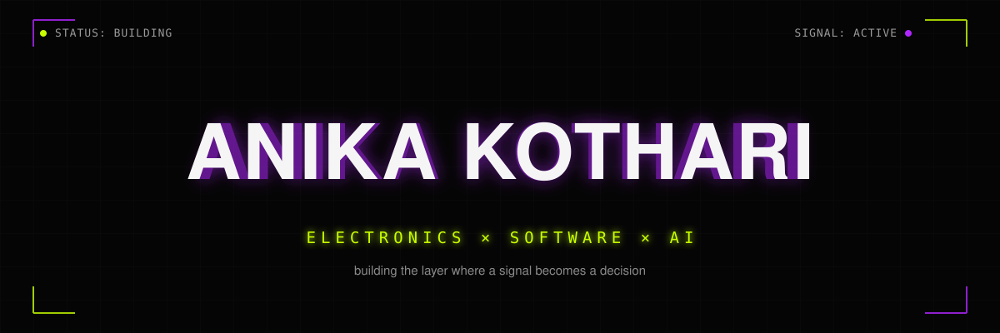
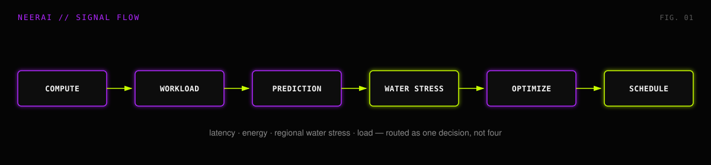

<!--
  ══════════════════════════════════════════════════════════════════
  ANIKA KOTHARI -GitHub profile README -EDITING GUIDE (hidden)
  ══════════════════════════════════════════════════════════════════
  This whole guide is an HTML comment -invisible when rendered on
  GitHub, visible only when you (or future-you) open this file to edit.

  COLOR TOKENS
    black  #050505   white  #F5F5F5   purple #B026FF
    lime   #C8FF00   grey   #8a8a8a

  PAGE STRUCTURE
    hero.svg  → nav badges → About → System Log → Projects
    (Active Build, then Shipped) → Stack → Contact

  REUSABLE CHROME
    assets/winbar.svg  -the dark strip with 3 dots + "SYSTEM ONLINE"
    that sits above every "##" heading. Just drop
     above any new section
    heading to match the look. Don't edit the SVG itself -it has no
    text baked in that needs changing.

    assets/divider.svg -thin gradient rule used for breathing room
    between major blocks.

  ── ADD A SYSTEM LOG ROW (was "Experience") ──────────────────────
  It's a plain markdown table now -just add a row:
  | 20XX·MON–MON | Role -Organization | tag1 · tag2 |

  ── ADD A "SHIPPED" PROJECT CARD ─────────────────────────────────
  Copy one <td>...</td> block between the PROJECT CARD START/END
  markers below, paste into a <tr>, edit the contents. Two <td>s
  per <tr>. Use `[ HW ]` or `[ SW ]` (or your own tag) as the
  category marker up front so the hardware/software mix stays
  visible at a glance.

  ── ADD AN "ACTIVE BUILD" (ongoing project) ──────────────────────
  Ongoing work lives above Shipped, tagged with the
  STATUS-ACTIVE BUILD badge instead of a repo link. Copy the Techy
  Bhai block (the smaller of the two Active Build entries) as your
  template -it doesn't need a custom diagram. Only give a project
  the full NeerAI treatment (own SVG flow diagram) if it's your
  actual flagship; otherwise the small-card format is enough.

  ── MOVE SOMETHING FROM ACTIVE BUILD → SHIPPED ───────────────────
  Once it's done: swap the STATUS badge for a "REPO →" badge, and
  move the block down into the Shipped table.

  ── STACK TABLE ───────────────────────────────────────────────────
  One <tr> per category. Edit the `·`-separated list in the second
  <td>. Add "(learning)" after anything not solid yet.
  ══════════════════════════════════════════════════════════════════
-->

<i>learning never hits exit, only run.</i>

  

  

 

## About

<table width="100%">
<tr>
<td width="140" valign="top">

<b>ROLE</b> 
<b>FOCUS</b> 
<b>LOOP</b> 
<b>BASED</b>

</td>
<td valign="top">

3rd year,Btech, Electronics and Computer Science Engg. 
software systems and applied AI, with a real embedded/hardware foundation underneath 
Plan → Code → Test → Optimize 
SRM Institute of Science & Technology, Chennai, India

</td>
</tr>
</table>

Equally comfortable writing the firmware that reads a sensor and the pipeline that decides what to do with what it read. Recent work sits at that seam -safety research on software-defined vehicles, fault injection in simulation, ECU and kill-switch circuits on an actual kart, and AI systems that never touch hardware at all. Same instinct either way: find where the signal is lying to you, then fix it.

 

 

## System Log

<!-- add a row: | 20XX·MON–MON | Role -Organization | tag1 · tag2 | -->

| TIME | PROCESS | TAGS |
|:--|:--|:--|
| `2026 · MAY–JUL` | SDV & AI Automotive Safety Research Intern -IIT Indore | SDV · SOTIF · Rust · STM32F407 |
| `2026 · FEB–PRESENT` | Electrical & Firmware -Team Full Throttle (GKDC Kart) | C/C++ · ECU integration · kill-switch design |
| `2026 · MAY–JUN` | Research Intern -Open Knowledge Initiatives × IIIT-H | SPARQL · Wikidata · OCR pipelines |
| `2025 · JUL–PRESENT` | Committee Member, Sponsorship & Mgmt -Aaruush | corporate pitching · MoUs |
| `2025 · DEC` | Industrial Trainee -Pi-Tech India (MSME Certified) | Arduino · ESP32 · UART/I2C/SPI |

 

 

## Projects

 &nbsp;currently running

**`[ FEATURED ]`**

### NEERAI -water-stress-aware compute scheduling

Data centres get sited and scheduled around latency and cost -almost never around water. NeerAI adds regional water stress as a real scheduling variable, not a footnote, and routes compute accordingly.

**what it does** -profiles workloads, predicts resource pressure, and runs a multi-objective optimizer (`J = αC + βE + γWs + δL`) across compute, energy, and water stress before a job ever gets placed.

**what's built so far** -the optimizer, a Python digital-twin harness for simulating infrastructure telemetry, and a routing layer that turns four competing variables into one decision. Still actively evolving.

`Python` · `XGBoost` · `optimization` · `digital twins` · `telemetry`

 

<table width="100%">
<tr>

<!-- PROJECT CARD START -->
<td width="100%" valign="top">

**`[ SW ]` TECHY BHAI**
micro-learning platform

Full-stack platform delivering personalized tech content through a recommendation engine, with JWT + Google OAuth auth and a MySQL schema built around a user-interest graph.

`Next.js` `Node.js` `Express` `MySQL`

</td>
<!-- PROJECT CARD END -->

</tr>
</table>

 

 &nbsp;done, working, out in the world

<!--
  PROJECT CARD TEMPLATE -copy one <td>...</td> block, paste into a <tr>, edit contents.
  Two <td> cells per <tr>. Add a new <tr> for every 2 new projects.
-->

<table width="100%">
<tr>

<!-- PROJECT CARD START -->
<td width="50%" valign="top">

**`[ HW ]` RAILSENTINALS**
track safety & hazard detection · SIH 2025 National Finalist

AI-vision + sensor fusion system for automated railway track defect monitoring. ESP32 nodes process ballast health and obstacle telemetry in real time; loco-aware braking logic computes emergency stopping distances on hazard detection.

`ESP32` `Embedded C++` `Computer Vision` `Python`

</td>
<!-- PROJECT CARD END -->

<!-- PROJECT CARD START -->
<td width="50%" valign="top">

**`[ SW ]` NEWSZ**
graph-based news exploration engine

Converts unstructured news into a navigable knowledge graph -custom adjacency-list structures, binary-heap priority queues, and Union-Find powering Dijkstra's and Kruskal's traversal modes, with LLM-based keyword extraction on top.

`JavaScript (ES6+)` `Graphs` `Union-Find` `LLM APIs`

</td>
<!-- PROJECT CARD END -->

</tr>
<tr>

<!-- PROJECT CARD START -->
<td width="50%" valign="top">

**`[ HW ]` AGRITECH**
closed-loop sensor controller

ESP32-based closed-loop controller processing real-time soil-moisture telemetry to trigger automated irrigation cycles. Implemented software hysteresis to kill relay chatter and cut power draw.

`ESP32` `Embedded C++` `Hardware Control`

</td>
<!-- PROJECT CARD END -->

<!-- PROJECT CARD START -->
<td width="50%" valign="top">

**`[ SW ]` ASCENDRA**
AI-driven career roadmap platform

Cross-platform app that treats skill growth like a dependency graph. LLM APIs generate adaptive roadmaps and missions with stateful context across sessions; Firebase handles real-time sync and auth.

`Flutter` `Firebase` `LLM APIs`

</td>
<!-- PROJECT CARD END -->

</tr>
<tr>

<!-- PROJECT CARD START -->
<td width="100%" valign="top" colspan="2">

**`[ SW ]` ADVERA**
blockchain ad-settlement & fraud resolution

Off-chain Python engine using Merkle-tree inclusion proofs to verify ad-impression records, with Solidity contracts that process submission hashes on-chain and auto-flag disputed activity.

`Solidity` `Python` `MySQL` `Merkle Trees`

</td>
<!-- PROJECT CARD END -->

</tr>
</table>

 

<b>FIELD NOTES</b>

`[2025]` SIH National Finalist -RailSentinals, AI-vision track hazard monitoring system
`[2026]` IIT Indore -SDV / SOTIF safety research
`[2026]` OKI × IIIT-H -performance stipend, cohort of ~140
`[——]` National Spelling Bee -3rd place

 

 

## Stack

<!-- one <tr> per category. Edit the `·`-separated list. Add "(learning)" for anything not solid yet. -->

<table width="100%">
<tr><td width="170"><b>LANGUAGES</b></td><td>Python · C · C++ · JavaScript (ES6+) · SQL · Solidity · Rust (foundations)</td></tr>
<tr><td><b>WEB & BACKEND</b></td><td>React · Node.js · Express · REST APIs · JWT · Google OAuth · HTML/CSS</td></tr>
<tr><td><b>AI & AUTOMOTIVE</b></td><td>ML Fundamentals · LLM APIs · SOTIF · SDV Architectures · CARLA · LGSVL · NVIDIA DRIVE Sim · IPG CarMaker</td></tr>
<tr><td><b>EMBEDDED & HARDWARE</b></td><td>STM32F407 · ESP32 · Arduino · CAN / UART / SPI / I2C · Digital Twins · OTA Updates</td></tr>
<tr><td><b>TOOLS & INFRA</b></td><td>Git · MySQL · Firebase · Linux · Docker (learning) · Microservices (learning)</td></tr>
</table>

 

 

## Contact

Building NeerAI, applying elsewhere, always open to the interesting kind of problem.

 
